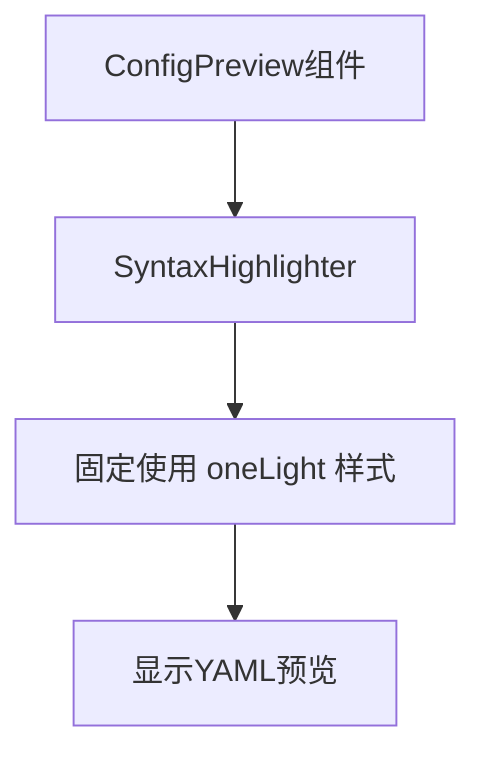
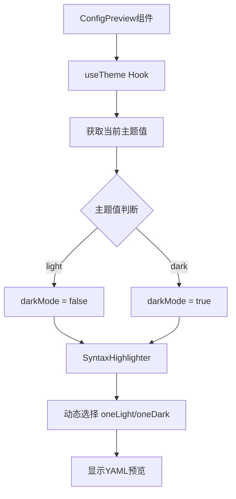

# Change: ConfigPreview组件主题同步优化

## Why

ConfigPreview组件中的YAML代码预览区域使用了SyntaxHighlighter组件来展示Docker Compose配置，但该组件当前硬编码使用`darkMode = false`，导致无论应用处于亮色还是暗色主题，代码预览始终使用`oneLight`样式。这在暗色主题下造成视觉不一致，影响用户体验。

## What Changes

- 修改`ConfigPreview`组件，使其能够感知当前应用主题状态
- 使用`useTheme` Hook获取当前主题值（`"light"`或`"dark"`）
- 将主题值转换为`darkMode`布尔值传递给`SyntaxHighlighter`组件
- 确保代码预览区域的语法高亮主题与应用全局主题保持同步

## UI Design Changes

无新增UI元素，仅修改现有代码预览区域的主题响应行为。

## Code Flow Changes

### 修改前的数据流

### 修改后的数据流

## Impact

- **Affected specs:** `theme-switching` (主题切换功能规范)
- **Affected code:**
  - `src/components/docker-compose/ConfigPreview.tsx` - 主要修改点
  - `src/components/ui/syntax-highlighter.tsx` - 确认现有`darkMode`属性工作正常
- **Benefits:**
  - 提升用户体验：代码预览区域样式与应用整体主题保持一致
  - 增强视觉连贯性：避免在暗色主题下出现亮色代码预览区域的突兀效果
  - 符合主题切换规范：确保所有UI组件（包括代码预览）都正确响应主题切换
- **Risks:**
  - 低风险：仅修改单个组件的主题感知逻辑，不涉及架构变更
  - `SyntaxHighlighter`组件已支持`darkMode`属性，无需修改
  - 需要测试在两种主题下的显示效果

## Dependencies

- 依赖现有的主题管理系统（`ThemeProvider`和`useTheme` Hook）
- 依赖`SyntaxHighlighter`组件的`darkMode`属性
- 无新增外部依赖

## Migration Plan

无需数据迁移或用户数据迁移。用户刷新页面后将自动获得主题同步的代码预览体验。

## Testing Strategy

1. **功能测试**
   - 在亮色主题下验证代码预览使用`oneLight`样式
   - 在暗色主题下验证代码预览使用`oneDark`样式
   - 切换主题时验证代码预览主题同步更新

2. **视觉回归测试**
   - 确保代码预览区域在两种主题下都有适当的对比度
   - 确保语法高亮颜色在两种主题下都清晰可读

3. **边界条件测试**
   - 页面刷新后主题状态正确恢复
   - localStorage中无主题数据时的默认行为
