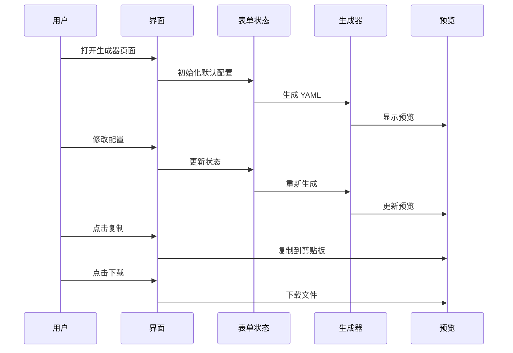
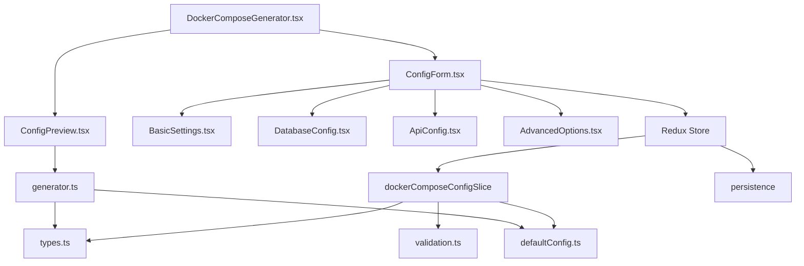

## Context

当前项目是一个基于 shadcn/ui 组件库的前端项目，使用 React + TypeScript + Vite 架构。项目需要确立核心功能定位，将现有的 Docker Compose 生成器功能从 `pcode-docs` 项目迁移到当前项目中，作为主功能核心。

## Goals / Non-Goals

### Goals
- 完全迁移 pcode-docs 项目中的 Docker Compose 生成器功能
- 复用现有 shadcn/ui 组件库，保持 UI 一致性
- 确保功能完整性和用户体验
- 建立清晰的项目架构和代码组织

### Non-Goals
- 不重构现有的 shadcn/ui 组件库
- 不添加超出原始功能范围的新特性
- 不改变项目的基础技术栈（React + TypeScript + Vite）

## Decisions

### 1. 代码组织方式

**决定**: 采用功能模块化架构，将 Docker Compose 生成器相关代码放在 `src/pages/`、`src/components/docker-compose/` 和 `src/lib/docker-compose/` 目录中。

**理由**:
- 保持与项目现有架构一致
- 功能代码与通用组件分离
- 便于后续维护和扩展

### 2. 类型定义迁移

**决定**: 完整迁移 pcode-docs 项目中的类型定义，并根据当前项目架构进行优化。

**理由**:
- 原始类型定义已经过验证和测试
- 保持功能兼容性
- 便于后续扩展功能

### 3. YAML 生成器实现

**决定**: 复用原始的 YAML 生成逻辑，但使用更模块化的代码结构。

**理由**:
- 原始生成逻辑已成熟且功能完整
- 模块化设计便于维护和测试

### 4. UI 组件实现

**决定**: 使用 shadcn/ui 组件库重新实现 UI，替代原始的 Docusaurus 组件。

**理由**:
- 保持项目 UI 一致性
- shadcn/ui 提供了现代化的组件
- 更好的用户体验和可访问性

### 5. 状态管理

**决定**: 使用 Redux Toolkit 进行状态管理。

**理由**:
- 提供更强大的状态管理能力
- 更好的调试工具和开发体验
- 便于状态持久化和缓存
- 支持更复杂的业务逻辑扩展
- 符合现代前端开发最佳实践

## UI/UX Design

### 页面布局

**桌面端布局**:
```
┌─────────────────────────────────────────────────────────┐
│  配置表单区域 (60%)  │  配置预览区域 (40%)                │
├──────────────────────┬───────────────────────────────────┤
│  基础设置            │  YAML 预览                        │
│  - HTTP 端口         │  - 代码高亮显示                   │
│  - 容器名称          │  - 一键复制按钮                   │
│  - 镜像版本          │  - 下载按钮                       │
│  - 宿主机操作系统     │                                   │
│                      │                                   │
│  数据库配置          │                                   │
│  - 数据库类型        │                                   │
│  - 数据库名称        │                                   │
│  - 用户名/密码       │                                   │
│                      │                                   │
│  许可证配置          │                                   │
│  - 许可证类型        │                                   │
│  - 许可证密钥        │                                   │
│                      │                                   │
│  API 配置            │                                   │
│  - API 提供商        │                                   │
│  - API Token         │                                   │
│  - API 端点 URL      │                                   │
│                      │                                   │
│  高级选项            │                                   │
│  - 卷挂载配置        │                                   │
│  - 用户权限映射      │                                   │
│                      │                                   │
└──────────────────────┴───────────────────────────────────┘
```

**移动端布局**:
```
┌─────────────────────────────────────────────────────┐
│  配置表单区域                                        │
├─────────────────────────────────────────────────────┤
│  基础设置                                           │
│  数据库配置                                         │
│  许可证配置                                         │
│  API 配置                                           │
│  高级选项                                           │
└─────────────────────────────────────────────────────┘

┌─────────────────────────────────────────────────────┐
│  配置预览区域                                        │
├─────────────────────────────────────────────────────┤
│  YAML 预览                                          │
│  一键复制按钮                                        │
│  下载按钮                                            │
└─────────────────────────────────────────────────────┘
```

### 交互流程



## Technical Design

### 架构图



### 核心模块说明

#### 1. 类型和配置模块
- `types.ts`: 定义所有类型和接口
- `defaultConfig.ts`: 提供默认配置
- `validation.ts`: 配置验证逻辑

#### 2. 状态管理模块
- Redux Store 配置（使用 Redux Toolkit）
- Slice 定义：dockerComposeConfigSlice
- Thunk actions：异步操作（如配置保存、导入）
- Selectors：用于从 store 中获取配置状态
- 提供配置的获取、更新、重置和持久化功能

#### 3. 生成器模块
- `generator.ts`: 负责根据配置生成 Docker Compose YAML 文件
- 支持所有配置选项的组合

#### 4. UI 组件模块
- `DockerComposeGenerator.tsx`: 主页面组件
- `ConfigForm.tsx`: 配置表单组件
- `ConfigPreview.tsx`: 配置预览组件
- 表单字段组件: 负责不同配置分组的 UI

## Risks / Trade-offs

### 风险分析

| 风险 | 严重程度 | 概率 | 缓解措施 |
|------|----------|------|----------|
| 原始功能理解不完整 | 中等 | 低 | 仔细分析原始代码，进行充分测试 |
| UI 组件兼容性问题 | 低 | 中 | 使用已有的 shadcn/ui 组件，避免自定义组件 |
| 配置验证逻辑遗漏 | 低 | 中 | 完整迁移原始验证逻辑 |
| 响应式设计问题 | 低 | 中 | 使用 Tailwind CSS 响应式类 |

### 性能优化

- 使用 React.memo 和 useMemo 优化渲染性能
- 避免不必要的配置生成和预览更新
- 对代码高亮和复制功能进行优化

## Migration Plan

### 迁移步骤

1. 项目准备和架构设计
2. 类型定义和数据模型迁移
3. YAML 生成器实现
4. UI 组件开发
5. 功能集成和测试
6. 文档和收尾

### 回滚策略

如果迁移过程中出现无法解决的问题，可回退到原始项目结构，并考虑其他实现方案。

## Open Questions

1. 是否需要支持额外的配置选项？
2. 是否需要添加配置保存和导入功能？
3. 是否需要支持多种 Docker Compose 版本？
4. 是否需要添加配置模板功能？