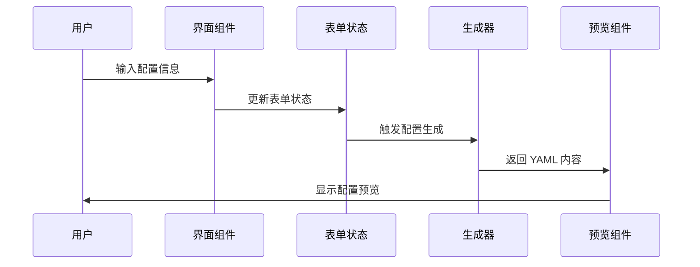

# Change: 迁移 Docker Compose 生成器功能

## Why

当前项目缺少核心功能定位，项目 repo 名称暗示了其潜在的 Docker Compose 生成工具方向，但尚未实现相关功能。而 `/home/newbe36524/repos/newbe36524/pcode-docs` 项目中已存在成熟的 Docker Compose 生成器功能，具备完整的配置生成、UI 交互和导出能力。

## What Changes

- **核心功能迁移**：将 Docker Compose 配置生成逻辑从 pcode-docs 项目迁移到当前项目
- **UI 组件重构**：复用现有 shadcn/ui 组件库，重新实现用户界面
- **架构整合**：将功能整合到当前项目的 React + TypeScript + Vite 架构中
- **状态管理**：使用 Redux Toolkit 管理应用状态，提供更好的开发体验和调试能力
- **路由配置**：添加 Docker Compose 生成器页面路由和导航
- **数据模型**：迁移配置类型定义和验证逻辑

## Impact

**功能层面：**
- 确立项目核心功能定位为 Docker Compose 生成工具
- 提供明确的用户价值主张
- 完善 Docker Compose 配置生成的用户体验

**技术层面：**
- 统一代码库，减少维护成本
- 利用现有 UI 组件加速开发
- 建立清晰的功能架构

**项目层面：**
- 明确项目发展方向
- 为后续功能迭代奠定基础
- 提升项目的整体完整性

## UI Design Changes

### 页面布局概览

```
┌─────────────────────────────────────────────────────────┐
│  Docker Compose Builder  │  文档  │  关于  │  设置      │
├─────────────────────────────────────────────────────────┤
│                                                         │
│  ┌──────────────────────┬─────────────────────────────┐  │
│  │                      │                             │  │
│  │  配置表单区域        │  配置预览区域                │  │
│  │                      │                             │  │
│  │  - 基础设置          │  - YAML 预览                │  │
│  │  - 数据库配置        │  - 一键复制                  │  │
│  │  - 许可证配置        │  - 导出功能                  │  │
│  │  - API 配置          │                             │  │
│  │  - 高级选项          │                             │  │
│  │                      │                             │  │
│  └──────────────────────┴─────────────────────────────┘  │
│                                                         │
└─────────────────────────────────────────────────────────┘
```

### 主要组件设计

1. **配置表单组件**：
   - 使用 shadcn/ui 的 Form、Input、Select、Checkbox 等组件
   - 表单字段分组展示（基础设置、数据库配置、API 配置等）
   - 实时表单验证和错误提示

2. **配置预览组件**：
   - 使用 react-syntax-highlighter 进行代码高亮
   - 支持一键复制到剪贴板
   - 实时更新预览内容

3. **导出功能**：
   - 提供下载按钮，将生成的配置保存为 docker-compose.yml 文件
   - 支持直接复制配置文本

## Code Flow Changes

### 数据流程



### 文件结构

```
src/
├── pages/
│   └── DockerComposeGenerator.tsx       # 主页面组件
├── components/
│   └── docker-compose/
│       ├── ConfigForm.tsx               # 配置表单组件
│       ├── ConfigPreview.tsx            # 配置预览组件
│       └── FormFields/
│           ├── BasicSettings.tsx        # 基础设置字段
│           ├── DatabaseConfig.tsx       # 数据库配置字段
│           ├── ApiConfig.tsx            # API 配置字段
│           └── AdvancedOptions.tsx      # 高级选项字段
├── lib/
│   └── docker-compose/
│       ├── types.ts                     # 类型定义
│       ├── generator.ts                 # YAML 生成器
│       ├── validation.ts                # 验证逻辑
│       └── defaultConfig.ts             # 默认配置
└── hooks/
    └── useDockerComposeConfig.ts        # 配置管理 Hook
```