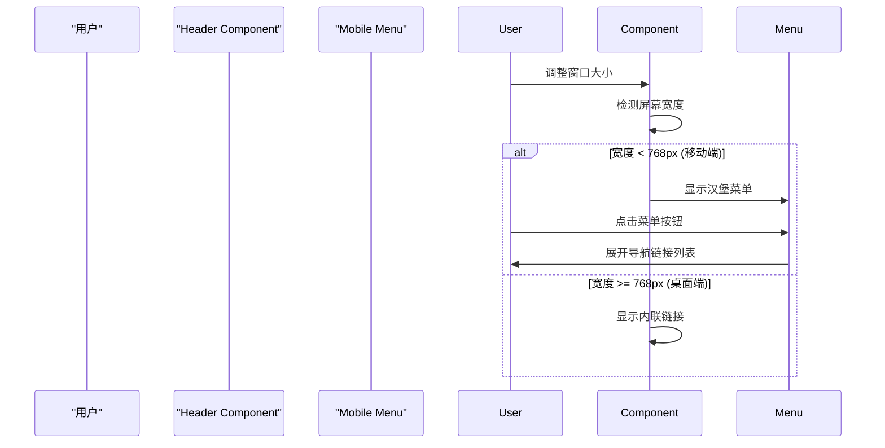

# Change: 添加 Hagicode 品牌标识和官方导航链接

## Why

当前站点缺乏完整的 Hagicode 品牌标识和官方资源入口，存在以下问题：

1. **品牌识别不清晰**：站点标题仍为占位符 "vite-app"，未体现 Hagicode 品牌标识
2. **缺少官方入口**：用户无法直接访问 Hagicode 官网、GitHub 仓库等官方资源
3. **社区入口缺失**：缺少 QQ 群社区入口，用户无法快速加入讨论和获得支持
4. **品牌一致性不足**：虽然部分内容已提及 Hagicode，但整体品牌标识不统一

为提升 Hagicode 组织的品牌识别度，并为用户提供清晰的官方资源访问路径，需要更新站点品牌标识并添加官方导航链接。

## What Changes

### 1. 更新站点标题
- 将 HTML `<title>` 从 "vite-app" 更新为 "Hagicode Docker Compose Builder"
- 在页面头部标题中体现 Hagicode 品牌和工具功能

### 2. 添加 Header 导航链接
在站点页面 header 区域添加以下官方资源链接：

- **Hagicode 官网**：https://hagicode-org.github.io/site/
- **GitHub 仓库**：https://github.com/HagiCode-org/site
- **QQ 群**：610394020

### 3. 国际化支持
为新增的导航链接提供中英文双语支持：
- 更新 `src/i18n/locales/en-US.json`
- 更新 `src/i18n/locales/zh-CN.json`

### 4. 响应式设计
确保导航链接在不同屏幕尺寸下均可用：
- 桌面端：在 header 右侧显示链接列表
- 移动端：考虑使用下拉菜单或可折叠导航

## UI Design Changes

### Header 布局设计

**当前布局**：
```
┌─────────────────────────────────────────────────────────┐
│ Docker Compose Builder                   [🌙] [🌐 语言]  │
│ Generate Docker Compose configurations for Hagicode     │
└─────────────────────────────────────────────────────────┘
```

**新布局（桌面端）**：
```
┌──────────────────────────────────────────────────────────────────────┐
│ Hagicode Docker Compose Builder              [官网] [GitHub] [QQ群]  │
│ Generate Docker Compose configurations for Hagicode     [🌙] [🌐 语言] │
└──────────────────────────────────────────────────────────────────────┘
```

**新布局（移动端）**：
```
┌────────────────────────────────────────────┐
│ Hagicode Docker Compose Builder    [≡ 菜单] │
│ Generate Docker Compose...         [🌙] [🌐]│
└────────────────────────────────────────────┘
│                                            │
│ 下拉菜单：                                  │
│ ┌────────────────────────────────────┐     │
│ │ Hagicode 官网                      │     │
│ │ GitHub 仓库                        │     │
│ │ QQ 群: 610394020                   │     │
│ └────────────────────────────────────┘     │
```

### 组件位置
- 导航链接将添加到 `DockerComposeGenerator.tsx` 的 header 区域
- 位于页面标题和副标题之间或右侧
- 与现有的主题切换器和语言切换器协调布局

### 链接样式设计
- 使用外部链接图标（↗）标识外部链接
- 按钮样式与现有的主题切换器和语言切换器保持一致
- 鼠标悬停时显示链接 tooltip

## Code Flow Changes

### 链接点击流程
```mermaid
sequenceDiagram
    participant "User" as "用户"
    participant "Header" as "Header Component"
    participant "Link" as "Navigation Link"
    participant "External" as "外部网站"

    User->>Link: 点击导航链接
    Link->>Header: 触发点击事件
    Header->>External: 在新标签页打开链接
    External-->>User: 显示目标页面
```

### 响应式布局切换流程


## Impact

### 用户体验改善
- 用户可以快速识别站点归属为 Hagicode 组织
- 提供清晰的官方资源访问路径（官网、GitHub）
- 便于用户加入 QQ 群社区参与讨论和获得支持
- 统一的品牌标识提升项目专业形象

### 品牌一致性
- 强化 Hagicode 组织品牌识别
- 统一官方资源和社区入口
- 与 Hagicode 生态中的其他项目保持品牌一致性

### 技术范围
- **Affected specs**: brand-identity（新增）、docker-compose-generator（修改）
- **Affected code**:
  - 修改 `index.html`（更新 HTML title）
  - 修改 `src/pages/DockerComposeGenerator.tsx`（添加导航链接）
  - 修改 `src/i18n/locales/en-US.json`（添加英文翻译）
  - 修改 `src/i18n/locales/zh-CN.json`（添加中文翻译）
  - 可能新增 `src/components/Header/NavigationLinks.tsx`（导航链接组件）

### 依赖关系
- 无前置依赖
- 可与现有的主题切换和国际化功能独立实施
- 不影响现有功能的使用

## Alternatives Considered

### 选项 1：将链接添加到页脚
- **优点**：不影响 header 布局，实现简单
- **缺点**：可见性较低，用户不易发现
- **决定**：不采用，因为导航链接应该是用户容易发现的核心入口

### 选项 2：添加到侧边栏
- **优点**：不占用 header 空间
- **缺点**：当前页面为双栏布局，添加侧边栏会压缩主要内容的显示空间
- **决定**：不采用，因为会降低主要内容的可用性

### 选项 3：使用顶部导航栏（推荐方案）
- **优点**：
  - 符合用户对导航链接位置的预期
  - 与现有 header 设计自然融合
  - 在移动端可以使用汉堡菜单，响应式友好
- **缺点**：需要调整 header 布局
- **决定**：采用此方案

## Open Questions

1. **移动端导航方式**：是否需要实现汉堡菜单，还是使用简单的内联滚动？
   - **建议**：使用汉堡菜单以保持 header 简洁

2. **链接图标**：是否为每个链接添加图标（官网、GitHub、QQ）？
   - **建议**：是，使用标准图标提升识别度

3. **QQ 群显示方式**：是直接显示群号还是使用"加入 QQ 群"按钮？
   - **建议**：显示群号，并添加复制到剪贴板功能
