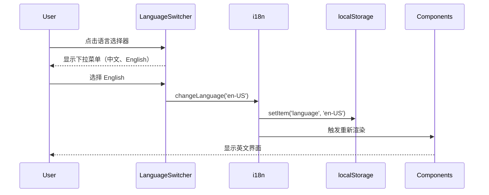
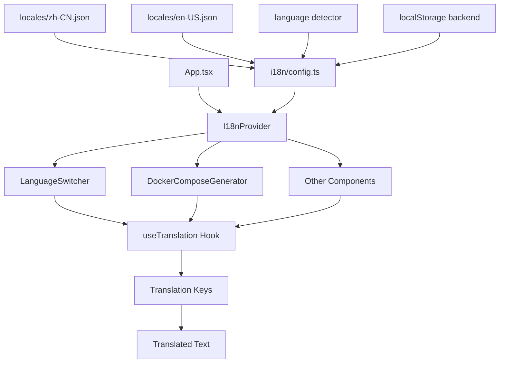
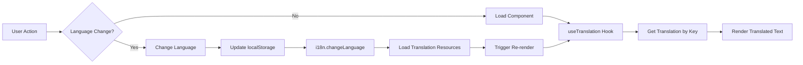

## Context

### Background
当前项目是一个 Docker Compose 配置生成器，所有 UI 文本均为中文硬编码。随着潜在国际化需求的增加，需要引入多语言支持机制以服务更广泛的用户群体。

### Constraints
- 必须保持向后兼容，不破坏现有功能
- 必须支持动态语言切换，无需刷新页面
- 必须使用 localStorage 存储用户语言偏好
- 初期支持中文（zh-CN）和英文（en-US）两种语言

### Stakeholders
- 最终用户：需要多语言支持的国际化用户
- 开发团队：需要维护和扩展语言资源的开发者
- 设计团队：确保 UI 在不同语言下的布局一致性

## Goals / Non-Goals

### Goals
- 引入 react-i18next 国际化框架
- 实现语言切换组件（支持中英文）
- 将所有硬编码文本迁移到语言资源文件
- 支持浏览器语言自动检测
- 使用 localStorage 持久化用户语言偏好

### Non-Goals
- 暂不支持 RTL（从右到左）语言（如阿拉伯语）
- 暂不支持服务端渲染（SSR）的国际化
- 暂不支持日期、数字格式的本地化处理
- 暂不涉及后端 API 的多语言支持

## Decisions

### Decision 1: 选择 react-i18next 作为国际化框架
**Reasoning**:
- react-i18next 是 React 生态系统中最成熟和广泛使用的国际化解决方案
- 提供完善的 TypeScript 支持
- 支持命名空间、插值、复数等高级功能
- 社区活跃，文档完善
- 体积小，性能优秀

**Alternatives considered**:
- `@lingui/react`: 更轻量，但生态较小，学习成本较高
- `formatjs/react-intl`: Intl API 标准，但配置相对复杂
- 自行实现：灵活但维护成本高，容易遗漏边界情况

### Decision 2: 语言资源文件使用 JSON 格式
**Reasoning**:
- JSON 格式易于阅读和编辑
- 支持 TypeScript 类型定义（可通过代码生成）
- 便于版本管理和协作
- react-i18next 原生支持

**Alternatives considered**:
- YAML 格式：更简洁，但需要额外的加载和解析逻辑
- TypeScript 对象：类型安全，但无法动态加载，增加 bundle 体积

### Decision 3: 默认语言为 zh-CN
**Reasoning**:
- 当前用户群体以中文为主
- 现有所有文本均为中文
- 降低初期迁移工作量

**Alternatives considered**:
- 根据浏览器语言动态设置：体验更好，但可能导致首次加载不一致
- 让用户主动选择：更灵活，但增加用户操作成本

### Decision 4: 语言检测优先级
**Priority**:
1. localStorage 中存储的用户语言偏好
2. 浏览器语言设置（navigator.language）
3. 默认语言（zh-CN）

**Reasoning**:
- 尊重用户的显式选择（localStorage）
- 其次尊重浏览器设置
- 最后使用合理的默认值

## UI/UX Design

### 组件位置
语言选择器将放置在页面 header 区域的右上角：

```
┌──────────────────────────────────────────────────────────────┐
│  Docker Compose Builder              [🌐 Language: 中文 ▾]   │
│  Generate Docker Compose configurations for Hagicode         │
└──────────────────────────────────────────────────────────────┘
```

### 交互流程


### 状态处理
- **Loading**: 语言资源加载时显示 loading 状态（如需要）
- **Error**: 语言资源加载失败时回退到默认语言
- **Success**: 语言切换成功后显示所有文本更新

### 响应式考虑
- 移动端：语言选择器字体大小适配
- 长文本：确保 UI 布局在不同语言文本长度下不破裂
- 对齐：确保文本右对齐语言（未来扩展）的布局兼容性

## Technical Design

### 架构设计


### 数据流


### 目录结构
```
src/
├── i18n/
│   ├── config.ts              # i18n 配置和初始化
│   └── locales/
│       ├── zh-CN.json         # 中文语言资源
│       └── en-US.json         # 英文语言资源
├── components/
│   ├── i18n/
│   │   └── LanguageSwitcher.tsx  # 语言切换组件
│   └── docker-compose/
│       ├── ConfigForm.tsx     # 修改：使用 i18n
│       └── ConfigPreview.tsx  # 修改：使用 i18n
└── pages/
    └── DockerComposeGenerator.tsx  # 修改：添加 LanguageSwitcher
```

### 语言资源命名空间设计
```json
{
  "common": {
    "loading": "加载中...",
    "error": "错误",
    "success": "成功"
  },
  "header": {
    "title": "Docker Compose Builder",
    "subtitle": "Generate Docker Compose configurations for Hagicode",
    "language": "Language"
  },
  "configForm": {
    "title": "Docker Compose Configuration Generator",
    "subtitle": "Configure your Hagicode Docker Compose setup",
    "basicConfig": "Basic Configuration",
    "httpPort": "HTTP Port",
    "containerName": "Container Name",
    ...
  },
  "configPreview": {
    "title": "Configuration Preview",
    "copy": "Copy",
    "download": "Download"
  }
}
```

### 组件集成示例
```typescript
// DockerComposeGenerator.tsx
import { LanguageSwitcher } from '@/components/i18n/LanguageSwitcher';
import { useTranslation } from 'react-i18next';

export function DockerComposeGenerator() {
  const { t } = useTranslation();

  return (
    <div className="min-h-screen bg-background">
      <header className="border-b bg-card">
        <div className="container mx-auto px-4 py-4 flex justify-between items-center">
          <div>
            <h1 className="text-2xl font-bold">{t('header.title')}</h1>
            <p className="text-sm text-muted-foreground">
              {t('header.subtitle')}
            </p>
          </div>
          <LanguageSwitcher />
        </div>
      </header>
      {/* ... */}
    </div>
  );
}
```

## Risks / Trade-offs

### Risks
1. **Bundle 体积增加**
   - 风险：引入 i18n 库和语言资源会增加 bundle 体积
   - 缓解：使用代码分割（lazy loading）按需加载语言资源

2. **文本遗漏**
   - 风险：可能遗漏部分硬编码文本
   - 缓解：使用 ESLint 插件检测中文字符，编写测试验证

3. **布局破裂**
   - 风险：不同语言文本长度差异导致 UI 布局问题
   - 缓解：使用 Tailwind 响应式类，测试不同语言的显示效果

4. **翻译质量**
   - 风险：英文翻译可能不够准确或专业
   - 缓解：提供简单的英文翻译，后续可由专业译者审核

### Trade-offs
1. **初期语言数量**
   - 决策：仅支持中文和英文
   - 权衡：覆盖主要用户群体，降低初期维护成本

2. **动态语言切换 vs 页面刷新**
   - 决策：支持动态语言切换（无需刷新）
   - 权衡：更好的用户体验，但需要确保所有组件正确响应

3. **命名空间粒度**
   - 决策：按页面/组件划分命名空间
   - 权衡：平衡组织性和灵活性

## Migration Plan

### 实施步骤
1. **Phase 1: 基础设施**
   - 安装依赖和配置 i18n
   - 创建语言资源文件
   - 实现语言检测和持久化

2. **Phase 2: 组件开发**
   - 开发 LanguageSwitcher 组件
   - 集成到页面 header

3. **Phase 3: 文本迁移**
   - 提取硬编码文本到语言资源
   - 更新组件使用 i18n hook
   - 逐步验证每个页面

4. **Phase 4: 测试和优化**
   - 功能测试
   - UI 兼容性测试
   - 性能优化（如需要）

### 回滚计划
- 保留原有硬编码文本作为注释（临时）
- 通过 feature flag 控制 i18n 功能开关（可选）
- Git 版本控制可随时回退

### 验证标准
- 所有页面文本正确显示中英文
- 语言切换无需刷新页面
- localStorage 正确保存和读取语言偏好
- 浏览器语言自动检测工作正常
- 无控制台错误或警告

## Open Questions

1. **是否需要支持更多语言？**
   - 当前仅支持中英文，未来可根据用户需求扩展

2. **是否需要翻译错误消息？**
   - 建议是，需要考虑表单验证错误的多语言支持

3. **是否需要翻译 URL 路径？**
   - 不需要，URL 保持英文（如 /docker-compose-generator）

4. **如何处理用户自定义内容？**
   - 用户输入的内容不需要翻译，仅翻译 UI 文本
