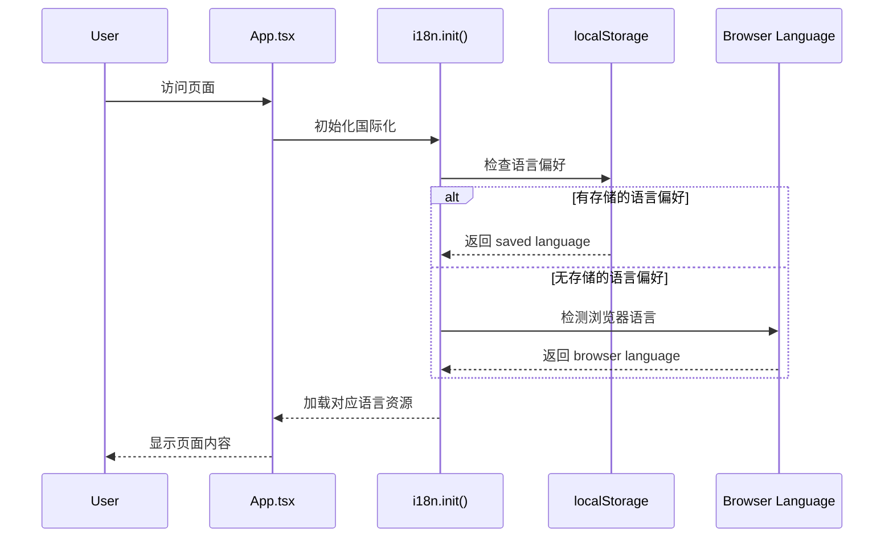
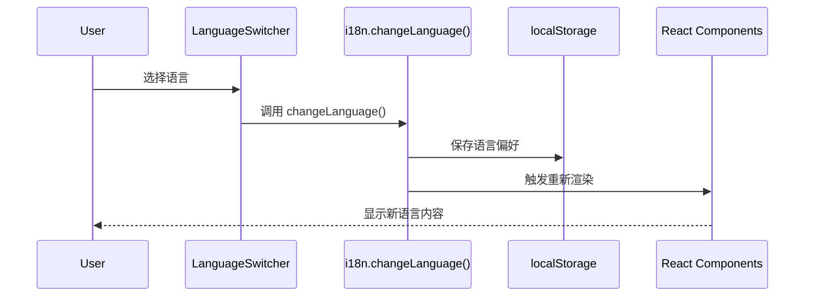

# Change: 国际化多语言支持功能

## Why
当前站点仅支持单一语言（中文），缺乏多语言支持机制，导致非中文用户无法有效使用站点。需要引入国际化框架和语言切换功能，以适应更广泛的用户群体。

## What Changes
- 引入 `react-i18next` 国际化框架
- 配置语言资源文件结构
- 实现语言切换组件（支持中文、英文）
- 将硬编码文本提取到语言资源文件
- 使用 localStorage 存储用户语言偏好
- 首次访问时根据浏览器语言自动检测

## UI Design Changes

### 语言切换组件设计
在页面右上角导航区域添加语言选择器，使用下拉菜单形式：

```
┌─────────────────────────────────────────────────────────┐
│ Docker Compose Builder  │ 🌐 Language: [中文 ▾]          │
└─────────────────────────────────────────────────────────┘

Dropdown options:
- 中文 (zh-CN)
- English (en-US)
```

### 组件位置
语言选择器将放置在 `DockerComposeGenerator.tsx` 页面的 header 区域，与现有标题并排显示。

## Code Flow Changes

### 初始化流程


### 语言切换流程


## Impact
- **Affected specs**: i18n（新增）、docker-compose-generator（修改）
- **Affected code**:
  - 新增 `src/i18n/` 目录（配置、语言资源）
  - 修改 `src/main.tsx`（初始化 i18n）
  - 修改 `src/pages/DockerComposeGenerator.tsx`（添加语言切换组件）
  - 修改 `src/components/docker-compose/ConfigForm.tsx`（替换硬编码文本）
  - 修改 `src/components/docker-compose/ConfigPreview.tsx`（替换硬编码文本）