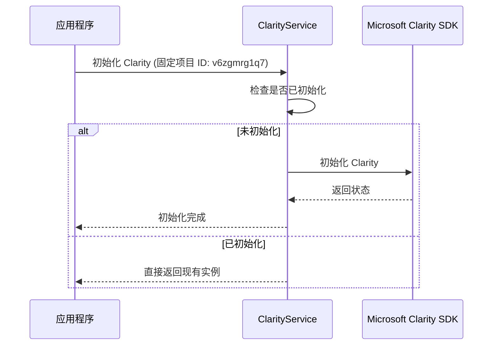
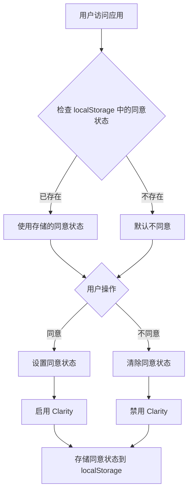

## Context

本项目是一个基于 React + TypeScript + Vite 的 Docker Compose 配置生成工具。为了更好地了解用户使用情况并优化产品，需要集成用户行为分析工具。Microsoft Clarity 是一个免费的用户行为分析工具，提供热力图、会话录制、用户行为路径等功能，帮助开发者理解用户如何与应用程序交互。

参考项目 `/home/newbe36524/repos/newbe36524/pcode` 已经成功实现了 Microsoft Clarity 的集成，我们将借鉴其实现方式。

## Goals / Non-Goals

**Goals:**
- 集成 Microsoft Clarity 到当前项目
- 实现与 pcode 项目相同的功能和架构
- 确保 GDPR/隐私合规性
- 简化组件中的使用方式
- 使用固定的 Clarity 项目 ID `v6zgmrg1q7`

**Non-Goals:**
- 不修改 pcode 项目的实现
- 不添加超出 Clarity 核心功能的自定义分析
- 不实现用户界面来管理 Clarity 配置

## Decisions

### 架构决策

**Decision 1: 采用与 pcode 相同的架构**
- **理由**：pcode 项目已经成功实现了 Clarity 集成，且架构清晰、功能完整
- **架构**：
  - `clarityService.ts` - 核心服务类，封装 Clarity SDK 操作
  - `useClarityConsent.ts` - React 钩子，简化同意管理
  - 固定配置 - 使用固定的 Clarity 项目 ID `v6zgmrg1q7`，始终启用

**Decision 2: 使用固定项目 ID 和始终启用配置**
- **理由**：简化配置，确保 Clarity 始终可用，无需环境变量设置
- **配置**：
  - 固定项目 ID：`v6zgmrg1q7`
  - 始终启用：Clarity 始终处于启用状态

### 技术决策

**Decision 3: 使用 @microsoft/clarity 包**
- **理由**：官方提供的 SDK，功能完整且维护良好
- **版本**：1.0.2（与 pcode 项目相同）

**Decision 4: 单例模式实现**
- **理由**：确保 Clarity 只初始化一次，避免重复加载
- **实现**：在 `ClarityService` 类中使用单例模式

**Decision 5: localStorage 存储同意状态**
- **理由**：持久化用户同意状态，跨会话保持
- **存储 key**：`clarity_consent`

## Technical Design

### 代码结构

```
src/
├── services/
│   └── clarityService.ts      # Clarity 核心服务
├── hooks/
│   └── useClarityConsent.ts  # 同意管理钩子
└── main.tsx                   # 应用入口，初始化 Clarity
```

### 初始化流程



### 同意管理流程



## Risks / Trade-offs

### 风险 1：Clarity SDK 加载失败
- **影响**：可能导致应用程序性能下降或错误
- **缓解**：实现错误处理和备用方案，确保 Clarity 加载失败不影响应用程序运行

### 风险 2：隐私合规问题
- **影响**：可能违反 GDPR 等隐私法规
- **缓解**：实现严格的同意管理机制，确保用户可以选择是否接受跟踪

### 风险 3：数据收集过多
- **影响**：可能影响应用程序性能
- **缓解**：仅收集必要的用户行为数据，避免过度跟踪

## Open Questions

- 是否需要添加用户界面来管理 Clarity 配置？（当前决定：不需要）
- 是否需要支持更多的事件跟踪功能？（当前决定：保持与 pcode 项目相同）