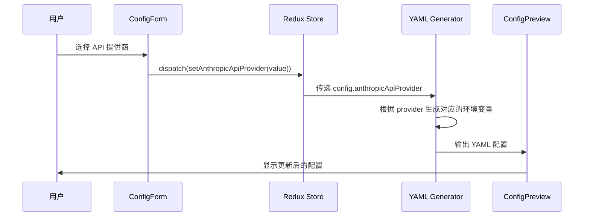

# Change: Docker Compose Builder API提供商配置优化

## Why

当前 Docker Compose Builder 项目中，API key 的提供商信息在 profile 配置中是硬编码的，限制了用户的灵活性。在快速配置模式下，用户无法根据实际需求切换不同的 API 服务提供商，需要手动修改生成的配置文件才能更改 provider，降低了快速配置功能的实用性和灵活性。

## What Changes

- 在 ConfigForm 组件中，API Provider 选择器在快速配置和完整自定义模式下均可见
- 当选择 Custom API Endpoint 时，API Endpoint URL 输入框在两种模式下均可见
- 更新表单验证逻辑以支持 provider 选择和自定义端点 URL
- 修改配置生成器以动态应用用户选择的 provider 和自定义端点
- 保持向后兼容性，未指定 providers 时使用默认值（ZAI）

## UI Design Changes

在 ConfigForm 组件的 Claude API Configuration 部分，无论使用何种 profile，都会显示完整的 API 配置选项：

```
Claude API Configuration
├── API Provider (新增，快速配置和完整自定义模式均可见)
│   ├── Zhipu AI (ZAI) [默认]
│   ├── Anthropic Official API
│   └── Custom API Endpoint
├── API Token (现有，必填)
└── API Endpoint URL (新增：快速配置模式下选择自定义提供商时可见)
```

## Code Flow Changes



## Impact

- 受影响的 specs：`docker-compose-generator`
- 受影响的代码：
  - `src/components/docker-compose/ConfigForm.tsx` - 新增 provider 选择器
  - `src/lib/docker-compose/types.ts` - 扩展类型定义
  - `src/lib/docker-compose/defaultConfig.ts` - 更新默认配置
  - `src/lib/docker-compose/generator.ts` - 确保生成逻辑正确处理 provider
  - `src/i18n/locales/en-US.json` 和 `src/i18n/locales/zh-CN.json` - 添加翻译文本
  - `src/lib/docker-compose/validation.ts` - 更新验证逻辑