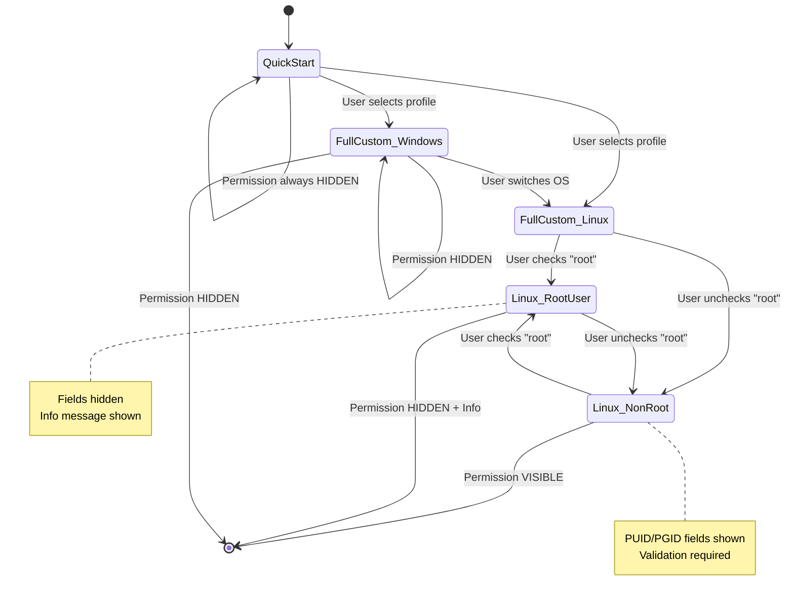
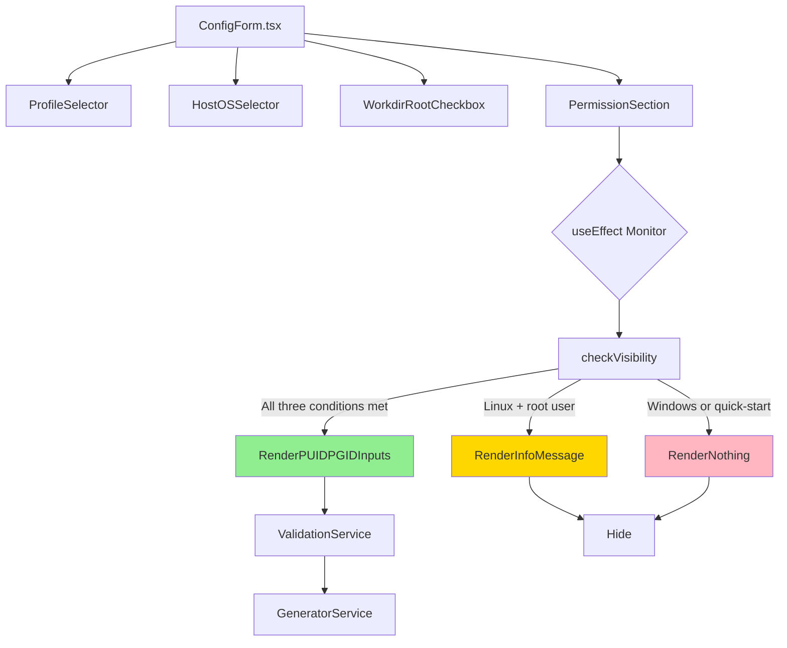
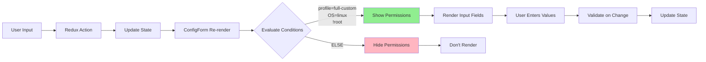
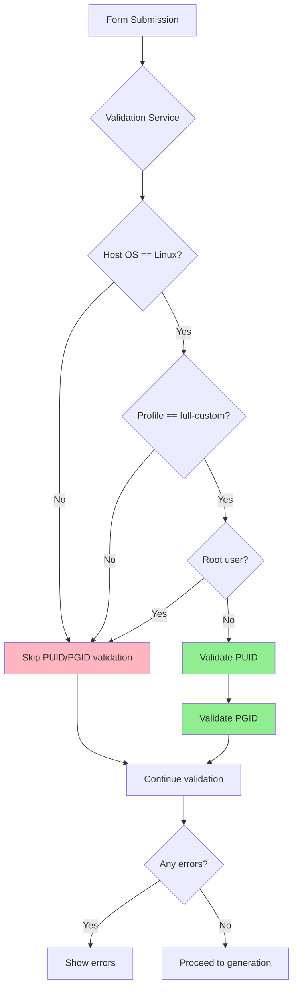

## Context

The Docker Compose Builder is a React-based web application that helps users generate Docker Compose configuration files through a visual form interface. Users can configure various parameters including deployment target (Windows/Linux), container settings, database options, and Linux-specific user permissions (PUID/PGID).

### Current Problem

The permission configuration (PUID/PGID with default value 1000) is currently displayed in scenarios where it doesn't apply:
- **Windows deployments**: Docker on Windows doesn't use the same user namespace mapping, making PUID/PGID irrelevant
- **Linux root user scenarios**: When the work directory is created by root, permission mapping is unnecessary
- **Quick-start profile**: Simplified mode that hides advanced options

This causes confusion as users may attempt to configure these values unnecessarily or wonder why they're being asked for information that doesn't apply to their deployment scenario.

### Stakeholders
- **End users**: Docker users deploying on Windows or Linux who need clear, relevant configuration options
- **Maintainers**: Developers who need to understand the conditional rendering logic for future modifications

## Goals / Non-Goals

### Goals
- Reduce user confusion by hiding irrelevant permission configuration fields
- Improve user experience by showing only configuration options applicable to the current deployment scenario
- Maintain backward compatibility - existing configurations should continue to work
- Preserve permission configuration functionality for Linux non-root users who need it
- Provide clear explanations when permission fields are hidden

### Non-Goals
- Changing the default PUID/PGID values (remain at 1000)
- Modifying the validation logic for PUID/PGID
- Changing how permissions are applied in generated Docker Compose files
- Adding new permission-related features
- Changing the quick-start profile behavior

## Decisions

### Decision 1: Three-Condition Check for Permission Field Visibility

**What**: Permission fields (PUID/PGID) will only be displayed when ALL of the following conditions are met:
1. `config.profile === 'full-custom'` - User is in advanced configuration mode
2. `config.hostOS === 'linux'` - Deployment target is Linux
3. `!config.workdirCreatedByRoot` - Work directory was NOT created by root user

**Why**:
- This ensures permission fields appear only when they are both applicable and required
- Windows doesn't use Linux user namespace mapping
- Root user scenarios don't need permission mapping (root has full access)
- Quick-start profile intentionally hides advanced options

**Alternatives considered**:
1. **Two-condition check (profile + OS only)**: Rejected because would show fields for Linux root users who don't need them
2. **Always show in full-custom**: Rejected because doesn't solve the Windows user confusion problem
3. **Separate permission toggle**: Rejected because adds unnecessary complexity - the three existing conditions are sufficient

### Decision 2: Informational Message for Root User Scenario

**What**: When a Linux user selects "Workdir created by root", display an informational message explaining why permission fields are hidden.

**Why**:
- Provides clarity on why the configuration option disappeared
- Educates users about Docker permission management
- Prevents users from thinking the feature is broken
- Maintains user trust through transparency

**Alternatives considered**:
1. **Hide without explanation**: Rejected - confusing for users who expect to see permission fields
2. **Disable fields instead of hiding**: Rejected - still causes confusion about why they can't configure permissions
3. **Tooltip only**: Rejected - not prominent enough, users might miss it

### Decision 3: Preserve Permission Values During Mode Switching

**What**: When users switch between Windows/Linux or toggle the root user option, preserve the entered PUID/PGID values in the state (even though fields may be hidden).

**Why**:
- Prevents data loss when exploring different configuration options
- Allows users to switch between scenarios without re-entering values
- Maintains consistency with how other form fields behave
- Redux state management already handles this correctly

**Alternatives considered**:
1. **Clear values when hiding fields**: Rejected - poor UX, users lose work
2. **Reset to defaults when switching modes**: Rejected - same as above
3. **Current approach (preserve)**: Accepted - best user experience

## UI/UX Design

### Visual Design

#### Permission Section - Linux Non-Root User (Visible)

```
┌─────────────────────────────────────────────────────────────────┐
│ 🔧 User Permission Configuration                                │
├─────────────────────────────────────────────────────────────────┤
│                                                                 │
│ ℹ️  Map container user to host user for file access            │
│                                                                 │
│     PUID [1000                          ] *                     │
│                                                                 │
│     PGID [1000                          ] *                     │
│                                                                 │
│     Example: Use `id -u` and `id -g` to find your user IDs    │
│                                                                 │
└─────────────────────────────────────────────────────────────────┘
```

#### Permission Section - Linux Root User (Hidden with Info)

```
┌─────────────────────────────────────────────────────────────────┐
│ 🔧 User Permission Configuration                                │
├─────────────────────────────────────────────────────────────────┤
│                                                                 │
│ ┌───────────────────────────────────────────────────────────┐  │
│ │ ℹ️  Permission Configuration Not Required                 │  │
│ │                                                           │  │
│ │ When the work directory is created by root, the          │  │
│ │ container will have full access without needing           │  │
│ │ permission mapping (PUID/PGID).                           │  │
│ └───────────────────────────────────────────────────────────┘  │
│                                                                 │
└─────────────────────────────────────────────────────────────────┘
```

#### Permission Section - Windows (Completely Hidden)

```
┌─────────────────────────────────────────────────────────────────┐
│ Configuration Form (Windows Mode)                               │
├─────────────────────────────────────────────────────────────────┤
│                                                                 │
│ Host OS: [Windows ▼]                                            │
│                                                                 │
│ (Permission section not rendered at all)                        │
│                                                                 │
│ ─────────────────────────────────────────────────────────────   │
│ Next Section: Volume Configuration...                           │
│                                                                 │
└─────────────────────────────────────────────────────────────────┘
```

### User Interaction Flows

#### Flow 1: Windows User Experience

```mermaid
flowchart TD
    A[User opens ConfigForm] --> B[Selects quick-start profile]
    B --> C[Host OS: Windows<br/>(default)]
    C --> D[Permission fields: HIDDEN]

    E[User switches to full-custom] --> F[Host OS: Windows]
    F --> G[Permission fields: HIDDEN]
    G --> H[User completes configuration]

    style D fill:#90EE90
    style G fill:#90EE90
```

#### Flow 2: Linux Root User Experience

```mermaid
flowchart TD
    A[User selects full-custom] --> B[Selects Linux as Host OS]
    B --> C{Configure workdir}
    C -->|Check "Created by root"| D[Permission fields: HIDDEN]
    D --> E[Info message shown]
    E --> F[User understands why]

    C -->|Uncheck "Created by root"| G[Permission fields: VISIBLE]
    G --> H[User enters PUID/PGID]

    style D fill:#FFD700
    style E fill:#FFD700
    style G fill:#90EE90
```

#### Flow 3: Linux Non-Root User Experience

```mermaid
flowchart TD
    A[User selects full-custom] --> B[Selects Linux as Host OS]
    B --> C{Configure workdir}
    C -->|Leave "Created by root" unchecked| D[Permission fields: VISIBLE]
    D --> E[Default values: 1000/1000]
    E --> F[User can customize]
    F --> G[Validation ensures values are set]

    C -->|Check "Created by root"| H[Permission fields: HIDDEN]
    H --> I[Info message shown]

    style D fill:#90EE90
    style E fill:#90EE90
    style H fill:#FFD700
```

### State Transition Diagram



### Responsive Design Considerations

#### Desktop Layout (≥768px)
- Two-column layout: Form (left) + Preview (right)
- Permission section uses full width when visible
- Info message uses blue/amber background with icon
- PUID/PGID inputs in grid (2 columns)

#### Mobile Layout (<768px)
- Single-column layout: Form (top) + Preview (bottom)
- Permission section stacks vertically
- Info message full width with appropriate padding
- PUID/PGID inputs stack vertically (full width each)

### Accessibility Considerations
- Info message uses appropriate ARIA attributes (role="alert" or role="status")
- Icon + text combination for better comprehension
- Sufficient color contrast for info messages
- Keyboard navigation maintains tab order
- Screen reader announces visibility changes

## Technical Design

### Component Architecture



### Data Flow



### Code Structure

#### ConfigForm.tsx Changes

```typescript
// Current logic (line 472):
{config.hostOS === 'linux' && (
  <div className="space-y-4">
    {!config.workdirCreatedByRoot && config.profile === 'full-custom' && (
      <div className="p-4 bg-blue-50 dark:bg-blue-950 rounded-md">
        {/* PUID/PGID inputs */}
      </div>
    )}
  </div>
)}

// New logic:
{config.profile === 'full-custom' && config.hostOS === 'linux' && (
  <div className="space-y-4">
    {!config.workdirCreatedByRoot ? (
      <div className="p-4 bg-blue-50 dark:bg-blue-950 rounded-md">
        {/* PUID/PGID inputs */}
      </div>
    ) : (
      <div className="p-4 bg-amber-50 dark:bg-amber-950 rounded-md">
        {/* Info message explaining why not needed */}
      </div>
    )}
  </div>
)}
```

### Conditional Logic Truth Table

| Profile | Host OS | Root User | Show Permission Fields? | Show Info Message? |
|---------|---------|-----------|-------------------------|-------------------|
| quick-start | Windows | N/A | ❌ No | ❌ No |
| quick-start | Linux | false | ❌ No | ❌ No |
| quick-start | Linux | true | ❌ No | ❌ No |
| full-custom | Windows | N/A | ❌ No | ❌ No |
| full-custom | Linux | true | ❌ No | ✅ Yes |
| full-custom | Linux | false | ✅ Yes | ❌ No |

### Validation Flow



### Generator Integration

The generator.ts file (around line 98) already has correct logic:
```typescript
if (config.hostOS === 'linux' && (config.puid || config.pgid)) {
  lines.push(`      PUID: ${config.puid}`);
  lines.push(`      PGID: ${config.pgid}`);
}
```

This ensures:
- Windows mode: No PUID/PGID in generated YAML
- Linux mode: PUID/PGID included if configured
- No changes needed to generator.ts

## Risks / Trade-offs

### Risk 1: Users Confused by Disappearing Fields
**Risk**: Users might think something is broken when fields disappear after checking "root user"

**Mitigation**:
- Clear informational message explaining why fields are hidden
- Smooth transitions (not abrupt removal)
- Message explains the reason directly

### Risk 2: Edge Cases Not Covered
**Risk**: Unusual deployment scenarios might not fit the three-condition model

**Mitigation**:
- Conditions are based on Docker fundamentals (Windows vs Linux namespace differences)
- Root user privilege model is well-understood
- Profile system provides flexibility (quick-start vs full-custom)

### Risk 3: Translation Burden
**Risk**: New info message needs translations for all supported languages

**Mitigation**:
- Use simple, clear language for the message
- Leverage existing i18n infrastructure
- Message is short and easy to translate

### Trade-off: Additional Code Complexity
**Trade-off**: Three-condition check is slightly more complex than current logic

**Justification**:
- Complexity is minimal and well-documented
- Significant improvement in user experience
- Reduces support burden and user confusion
- Code remains readable and maintainable

## Migration Plan

### Phase 1: Implementation (No User Impact)
- Update ConfigForm.tsx conditional rendering logic
- Add i18n translation keys
- Test all scenarios locally

### Phase 2: Testing
- Manual testing of all 6 scenarios (see truth table)
- Multi-language testing
- Responsive design testing
- Accessibility testing

### Phase 3: Deployment
- Deploy to production
- Monitor user feedback
- No data migration needed (UI-only change)

### Rollback Plan
If issues arise:
- Revert ConfigForm.tsx to previous logic
- Remove new i18n keys
- Simple git revert is sufficient
- No database changes to rollback

## Open Questions

None - all design decisions are clear and implementation is straightforward.

## Success Criteria

1. Permission fields only appear in Linux + full-custom + non-root scenarios
2. Windows users never see permission fields
3. Linux root users see explanatory message instead of permission fields
4. No regression in existing functionality
5. All translations complete and accurate
6. No TypeScript errors
7. All test scenarios pass
