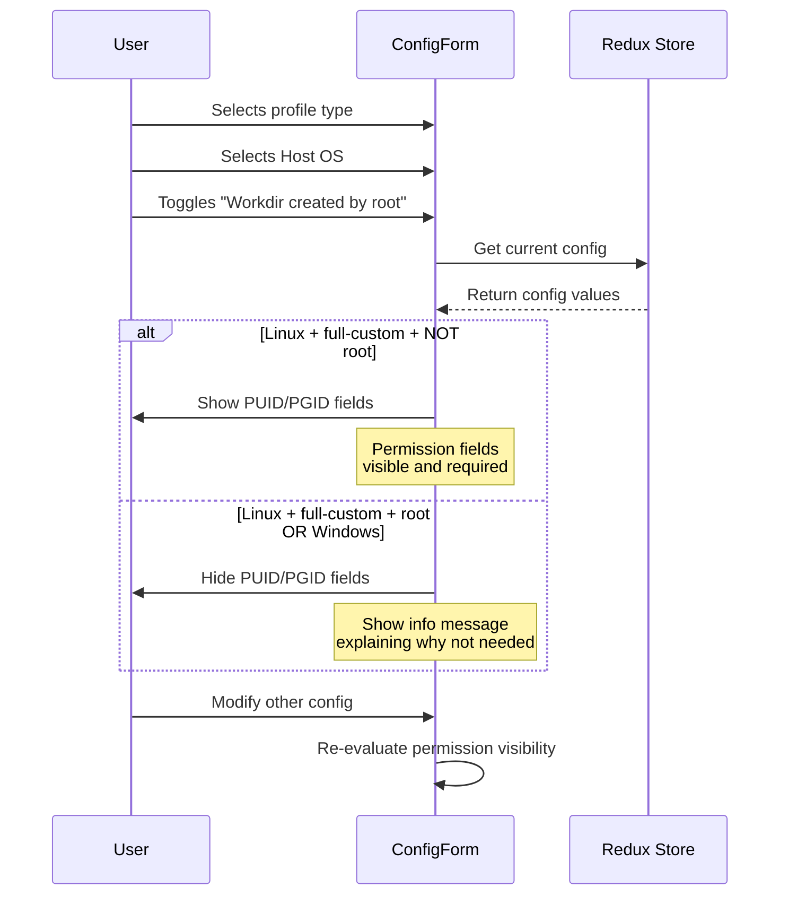
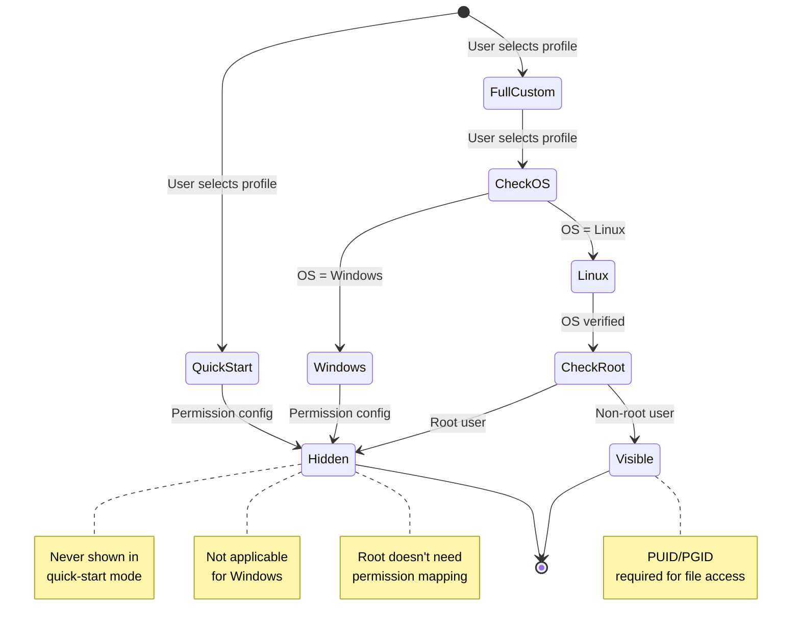
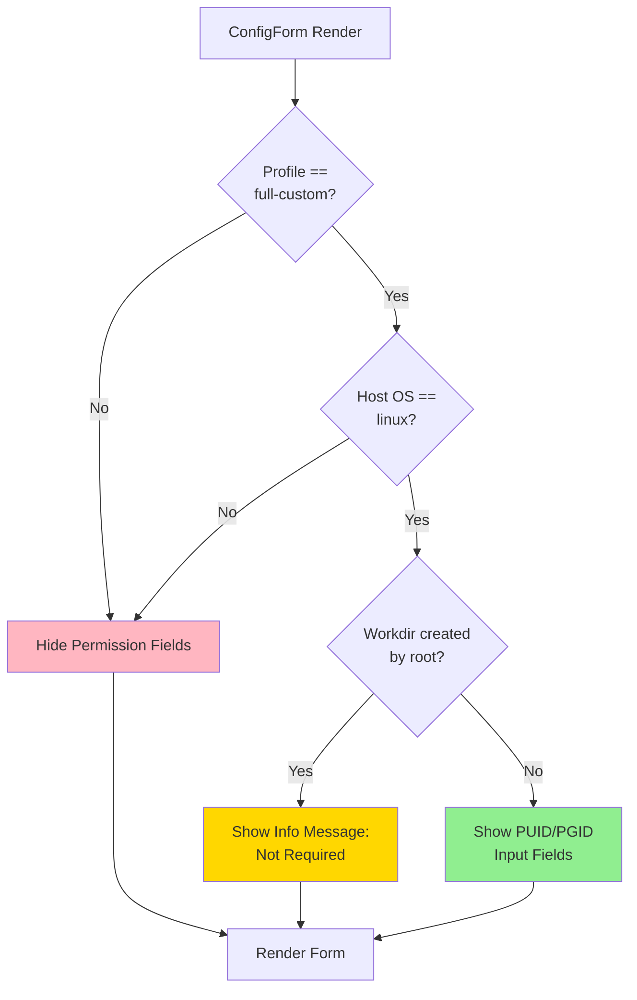
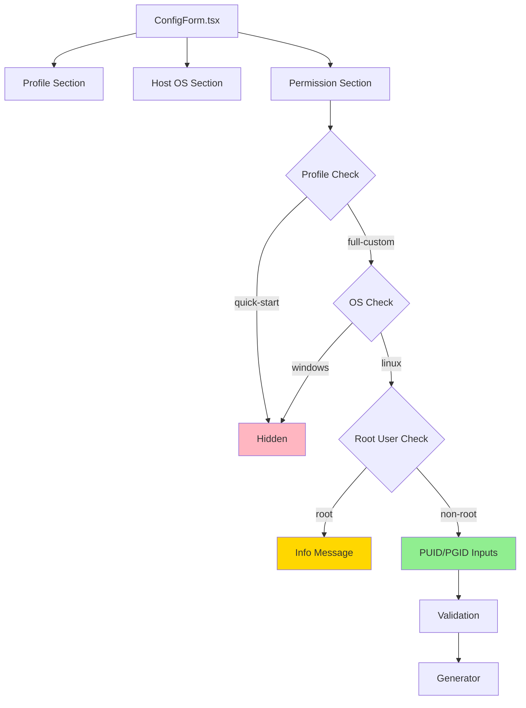
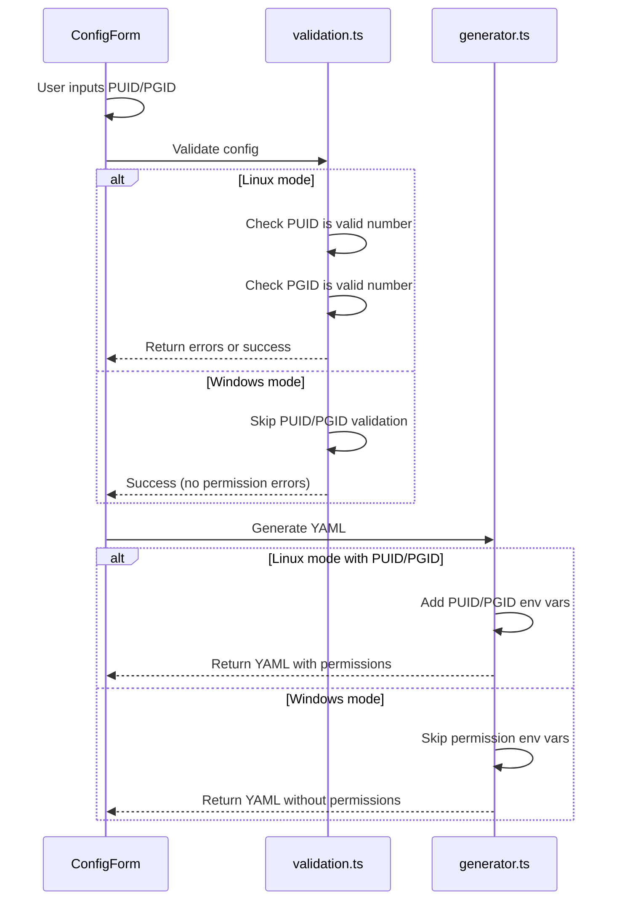

# Change: Optimize Docker Compose Permission Configuration Display Logic

## Why
The permission configuration (PUID/PGID with value 1000) is currently visible in all deployment scenarios, which causes user confusion:
- In Windows mode, these configuration fields have no actual effect
- For non-Linux deployments or root user scenarios, displaying these fields is meaningless
- Users may mistakenly believe they need to configure these values when they don't apply to their deployment

## What Changes
- **MODIFIED**: Permission configuration fields (PUID/PGID) will only be displayed when:
  - Host OS is set to 'Linux'
  - Profile is set to 'full-custom'
  - Work directory was NOT created by root user
- **MODIFIED**: The default profile remains as 'quick-start' (Windows-friendly mode)
- **MODIFIED**: Conditional rendering logic in ConfigForm component will check all three conditions before showing permission fields
- **UNCHANGED**: Default permission values remain at 1000 for Linux non-root users
- **UNCHANGED**: Validation logic for PUID/PGID remains the same

## UI Design Changes

### Current Behavior (Problem)
```
┌─────────────────────────────────────────┐
│ Configuration Form (Linux + full-custom)│
├─────────────────────────────────────────┤
│                                         │
│ Host OS: [Linux ▼]                      │
│                                         │
│ ☑ Workdir created by root              │
│   (Checked = hidden)                    │
│   (Unchecked = shown)                   │
│                                         │
│ ┌─────────────────────────────────────┐ │
│ │ Configure User Permission            │ │
│ │ PUID: [1000]                         │ │  ← Always shown when
│ │ PGID: [1000]                         │ │    unchecked + Linux
│ └─────────────────────────────────────┘ │
│                                         │
└─────────────────────────────────────────┘
```

### New Behavior (Solution)
```
┌─────────────────────────────────────────┐
│ Configuration Form (Linux + full-custom)│
├─────────────────────────────────────────┤
│                                         │
│ Host OS: [Linux ▼]                      │
│                                         │
│ ☑ Workdir created by root              │
│   ┌─────────────────────────────────┐   │
│   │ ℹ️ Permission Not Required      │   │
│   │                                 │   │
│   │ When workdir is created by      │   │
│   │ root, permission mapping is     │   │
│   │ not required.                   │   │
│   └─────────────────────────────────┘   │
│                                         │
│ OR                                      │
│                                         │
│ ☐ Workdir created by root              │
│   ┌─────────────────────────────────┐   │
│ │ Configure User Permission        │   │
│ │                                  │   │
│ │ PUID: [1000]            *         │   │  ← Only shown when
│ │ PGID: [1000]            *         │   │    unchecked + Linux
│ │                                  │   │
│ │ ℹ️ Maps container user to        │   │
│ │    host user for file access     │   │
│ └─────────────────────────────────┘   │
│                                         │
└─────────────────────────────────────────┘

┌─────────────────────────────────────────┐
│ Configuration Form (Windows + any)      │
├─────────────────────────────────────────┤
│                                         │
│ Host OS: [Windows ▼]                    │
│                                         │
│ (Permission section completely hidden)  │  ← Not shown for Windows
│                                         │
└─────────────────────────────────────────┘
```

### User Interaction Flow



### State Transitions



## Code Flow Changes

### Conditional Rendering Logic



### Component Architecture



### Data Flow for Permission Validation



## Impact
- **Affected specs**: docker-compose-generator (MODIFIED Requirement: 配置模式选择)
- **Affected code**:
  - `/src/components/docker-compose/ConfigForm.tsx` (lines 472-550) - Update conditional rendering logic
  - `/src/lib/docker-compose/validation.ts` (lines 98-106) - Already correct, no changes needed
  - `/src/lib/docker-compose/generator.ts` (permission section) - Already correct, no changes needed
- **Benefits**:
  - Improved user experience by eliminating irrelevant configuration options
  - Reduced confusion for Windows users and Linux root users
  - Maintained functionality for Linux non-root users who need permission configuration
- **Risks**:
  - Low risk - changes are limited to UI conditional rendering logic
  - Core functionality remains unchanged
  - Existing validation and generation logic already handle these conditions correctly

## Migration Plan
No migration needed - this is a UI-only improvement that doesn't change existing data structures or APIs. Default values remain unchanged.

## Open Questions
None - the requirements are clear and the implementation is straightforward.
