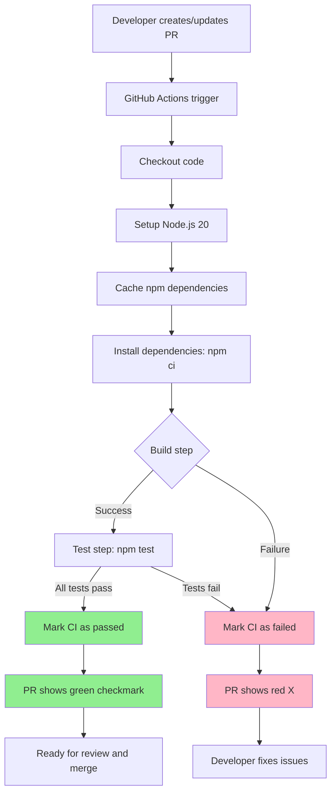

# Change: Add GitHub Actions PR Continuous Integration

## Why

The project currently lacks automated CI/CD workflows for pull requests, requiring manual verification of builds and tests before merging. This creates quality risks, reduces development efficiency, and increases the burden on code reviewers. Automated CI will provide immediate feedback on PR viability and serve as a quality gate before code enters the main branch.

## What Changes

- **Add GitHub Actions workflow** for PR-based continuous integration
  - Trigger on pull request creation and updates to target branches (main)
  - Run automated build verification using `npm run build`
  - Execute test suite using `npm test` (vitest)
  - Display CI status directly on PR pages for visibility
- **Configure Node.js environment** matching project requirements (Node.js 20)
- **Enable dependency caching** to improve workflow execution time
- **Optional**: Add test coverage reporting and artifact upload
- **Non-breaking**: Existing workflow (deploy.yml) remains unchanged

## UI Design Changes

N/A - This change affects developer tooling and CI/CD infrastructure only, with no end-user UI changes.

## Code Flow Changes

## Impact

- **Affected specs**:
  - `ci-integration` (NEW capability) - defines CI/CD automation requirements
- **Affected code**:
  - `.github/workflows/` - adds `ci.yml` for PR validation
  - No changes to source code, build configuration, or existing deployment workflow
- **Developer workflow impact**:
  - PRs now require passing CI checks before merge (enforceable via branch protection rules)
  - Immediate feedback on build and test failures
  - Reduced need for local full-test runs before submitting PRs
- **CI/CD infrastructure**:
  - Establishes foundation for future enhancements (linting, security scanning, performance tests)
  - Uses GitHub Actions free tier (sufficient for project scale)
