# Change: Update Image Tag and Add SQLite Database Support

## Why

The Hagicode project has updated its versioning strategy and deployment defaults. The `latest` image tag is no longer used for the latest version, and new deployments now support SQLite as a lightweight database option for quick-start scenarios. The current generator defaults need to be updated to align with these changes.

**Research Notes from pcode repository**:
- SQLite is the default database provider in Hagicode with automatic path generation
- Default SQLite connection string: `Data Source=./data/hagicode.db` (relative to app root)
- Container data directory: `/app/data` (for volume mounts)
- Image tags use semantic versioning (e.g., `0.1.0-beta.1`) instead of `latest`
- Reference: `/home/newbe36524/repos/newbe36524/pcode`

## What Changes

- **BREAKING**: Update default image tag from `latest` to `0` (as placeholder for latest stable version)
- **NEW**: Add `sqlite` as a new database type option
- **MODIFIED**: Quick-start profile now defaults to SQLite instead of internal PostgreSQL
- **MODIFIED**: Full-custom profile allows selection between SQLite, internal PostgreSQL, and external PostgreSQL
- **NEW**: Add SQLite volume mount configuration for data persistence (`/app/data` mount point)
- **MODIFIED**: Docker Compose generator to conditionally include/exclude PostgreSQL service based on database type

**Implementation Details** (based on pcode repository analysis and design decisions):
- **CRITICAL**: `Database__Provider` environment variable MUST be set based on database type
  - SQLite: `Database__Provider=sqlite`
  - PostgreSQL: `Database__Provider=postgresql` (or `PostgreSQL` - both work)
- SQLite connection string format: `Data Source=/app/data/hagicode.db` (fixed container path)
- PostgreSQL connection string format: `Host=postgres;Port=5432;Database=hagicode;Username=postgres;Password=postgres`
- **`hagicode_data:/app/data` named volume is ALWAYS included** (regardless of database type)
  - Contains SQLite database file when using SQLite
  - Contains other application data (Orleans grain storage, logs, etc.) for all database types
- Container path `/app/data` is **NOT user-configurable** (fixed by design)
- Users **DO NOT** configure SQLite data directory path - it's always a named volume
- SQLite requires no PostgreSQL service, no `depends_on` database dependency
- Image tag `0` represents the latest stable version (aligning with pcode deployment practices)

## UI Design Changes

### Quick-Start Mode
```
Docker Compose Generator - Quick Start
========================================

Required Fields:
- [Work Directory Path: _________________ ]
- [HTTP Port: 45000                     ]
- [API Token: __________________________ ]
- [Image Registry: (x) Aliyun ACR ( ) Docker Hub ( ) Azure ACR]
- [API Provider: (x) ZAI ( ) Anthropic ( ) Custom]

[Hidden: Database defaults to SQLite]
[Hidden: All other fields use sensible defaults]

[Generate Configuration] [Copy] [Download]
```

### Full-Custom Mode - Database Selection
```
Database Configuration:
======================
(x) SQLite        - Lightweight, file-based database (recommended for quick start)
( ) Internal PostgreSQL - Full PostgreSQL service running in container
( ) External PostgreSQL - Connect to existing PostgreSQL instance

[If SQLite selected:]
- Data stored in named volume (hagicode_data) mounted to /app/data (not user-configurable)

[If Internal PostgreSQL selected:]
- Database Name: [hagicode_________ ]
- Username:      [postgres_________ ]
- Password:      [****************]
- Volume Type:   ( ) Named ( ) Bind Mount
- Volume Path/Name: [postgres-data__________________________ ]

[If External PostgreSQL selected:]
- Host:     [____________________ ]
- Port:     [5432_______________ ]
- Database: [hagicode_________ ]
- Username:  [postgres_________ ]
- Password:  [****************]
```

### User Interaction Flow


## Code Flow Changes

### Database Configuration Flow


### Component Relationship Changes

```mermaid
graph TD
    A[DockerComposeConfig] -->|NEW| B[DatabaseType: 'sqlite' option]
    A --> C[ConfigProfile: 'quick-start']
    C -->|MODIFIED| D[Defaults to SQLite]

    E[buildAppService] -->|NEW| F{Check SQLite}
    F -->|Yes| G[Set SQLite connection string]
    F -->|No| H[Set PostgreSQL connection string]

    I[buildServicesSection] -->|NEW| J{Include PostgreSQL?}
    J -->|databaseType = 'internal'| K[buildPostgresService]
    J -->|databaseType = 'sqlite'| L[Skip PostgreSQL service]

    M[NEW: buildSqliteVolumes] --> N[Configure named volume hagicode_data → /app/data]
```


## Impact

- Affected specs: `docker-compose-generator`
- Affected code:
  - `src/lib/docker-compose/types.ts:6` - Add `'sqlite'` to `DatabaseType`
  - `src/lib/docker-compose/defaultConfig.ts:7` - Change `imageTag` from `'latest'` to `'0'`
  - `src/lib/docker-compose/defaultConfig.ts:12` - Change quick-start `databaseType` from `'internal'` to `'sqlite'`
  - `src/lib/docker-compose/generator.ts:57-152` - Modify `buildAppService()` to handle SQLite connection strings
  - `src/lib/docker-compose/generator.ts:207-223` - Modify `buildServicesSection()` to conditionally include PostgreSQL
  - `src/lib/docker-compose/generator.ts:230-241` - Modify `buildVolumesSection()` to handle SQLite named volume
  - New function: `buildSqliteVolumes()` in `src/lib/docker-compose/generator.ts` (generates named volume mount)

**Design Decision: Application data volume**
- Container path `/app/data` is **NOT user-configurable**
- Named volume `hagicode_data` is **always created** for ALL database types
  - SQLite: stores database file + other app data
  - PostgreSQL: stores Orleans grain storage, logs, and other non-database data
- Users **DO NOT** specify data directory path (simplified UX)
- PostgreSQL database data uses separate volume (`postgres-data`)

## Docker Compose Sample Comparison

This section shows the expected YAML output changes for verification.

### Before (current - PostgreSQL internal)

```yaml
services:
  hagicode:
    image: registry.cn-hangzhou.aliyuncs.com/hagicode/hagicode:latest
    container_name: hagicode-app
    environment:
      - ASPNETCORE_ENVIRONMENT=Production
      - ASPNETCORE_URLS=http://+:45000
      - TZ=Asia/Shanghai
      - Database__Provider=PostgreSQL
      - ConnectionStrings__Default=Host=postgres;Port=5432;Database=hagicode;Username=postgres;Password=postgres
      # ... other env vars
    ports:
      - "45000:45000"
    volumes:
      - /home/user/repos:/app/workdir
      - hagicode_data:/app/data
    depends_on:
      postgres:
        condition: service_healthy
    networks:
      - pcode-network
    restart: unless-stopped

  postgres:
    image: bitnami/postgresql:latest
    container_name: hagicode-postgres
    environment:
      - POSTGRES_DATABASE=hagicode
      - POSTGRES_USER=postgres
      - POSTGRES_PASSWORD=postgres
      - POSTGRES_HOST_AUTH_METHOD=trust
      - TZ=Asia/Shanghai
    volumes:
      - postgres-data:/bitnami/postgresql
    healthcheck:
      test: ["CMD", "pg_isready", "-U", "postgres"]
      interval: 10s
      timeout: 3s
      retries: 3
    networks:
      - pcode-network
    restart: unless-stopped

volumes:
  hagicode_data:
  postgres-data:

networks:
  pcode-network:
    driver: bridge
```

### After (new - SQLite default)

```yaml
services:
  hagicode:
    image: registry.cn-hangzhou.aliyuncs.com/hagicode/hagicode:0
    container_name: hagicode-app
    environment:
      - ASPNETCORE_ENVIRONMENT=Production
      - ASPNETCORE_URLS=http://+:45000
      - TZ=Asia/Shanghai
      - Database__Provider=sqlite
      - ConnectionStrings__Default=Data Source=/app/data/hagicode.db
      # ... other env vars
    ports:
      - "45000:45000"
    volumes:
      - /home/user/repos:/app/workdir
      - hagicode_data:/app/data
    # NO depends_on for SQLite
    networks:
      - pcode-network
    restart: unless-stopped

# NO postgres service when using SQLite

volumes:
  hagicode_data:

networks:
  pcode-network:
    driver: bridge
```

### Key Changes Summary

| Section | Before (PostgreSQL) | After (SQLite) |
|---------|-------------------|---------------|
| **Image tag** | `:latest` | `:0` |
| **Database__Provider** | `Database__Provider=PostgreSQL` | `Database__Provider=sqlite` |
| **Connection string** | `Host=postgres;Port=5432;...` | `Data Source=/app/data/hagicode.db` |
| **hagicode_data volume** | Present (for Orleans/logs) | Present (for SQLite + Orleans/logs) |
| **postgres-data volume** | Present (for PostgreSQL DB) | Removed |
| **depends_on** | `postgres: condition: service_healthy` | (removed) |
| **postgres service** | Included | Excluded |
| **volumes section** | `hagicode_data:` + `postgres-data:` | `hagicode_data:` only |

### Verification Checklist

#### All Configurations (Common)
- [ ] Image tag changed from `latest` to `0`
- [ ] `hagicode_data:/app/data` volume is **always present** (for app data: Orleans, logs, etc.)
- [ ] `volumes:` section **always defines** `hagicode_data:`
- [ ] `networks:` section remains unchanged

#### SQLite-Specific (Quick-Start / SQLite selected)
- [ ] `Database__Provider=sqlite` environment variable set
- [ ] Connection string uses SQLite format: `Data Source=/app/data/hagicode.db`
- [ ] No `depends_on` for database
- [ ] No `postgres` service in output
- [ ] No `postgres-data` volume

#### PostgreSQL-Specific (Internal PostgreSQL)
- [ ] `Database__Provider=postgresql` (or `PostgreSQL`) environment variable set
- [ ] Connection string uses PostgreSQL format: `Host=postgres;...`
- [ ] `depends_on: postgres:` with healthcheck condition present
- [ ] `postgres` service included with correct configuration
- [ ] `volumes:` section includes `postgres-data:` (in addition to `hagicode_data:`)
