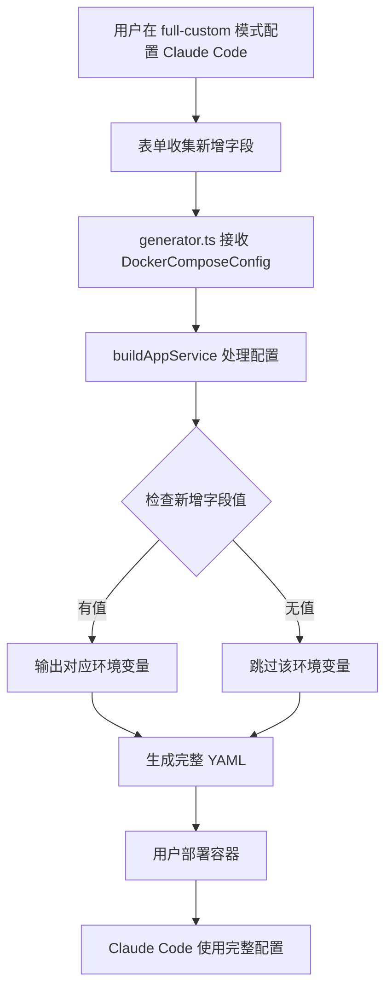
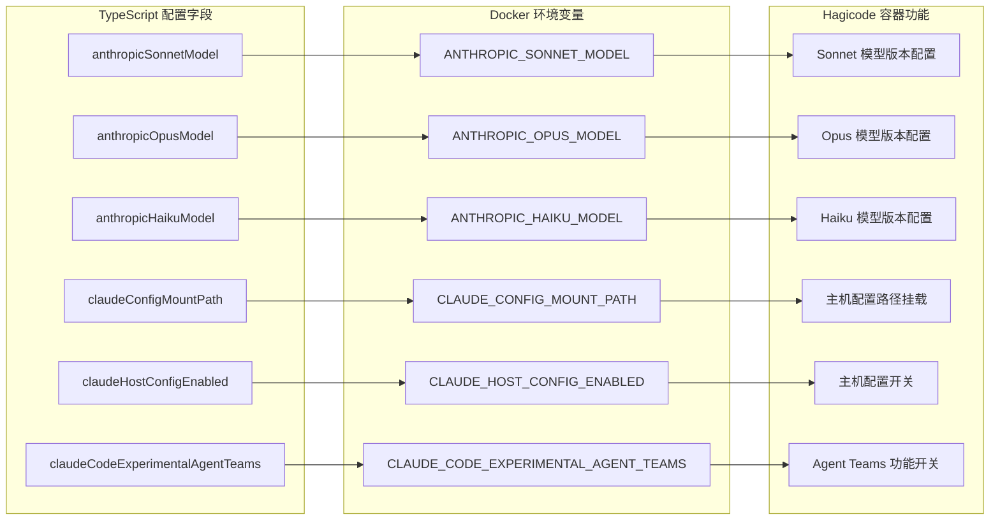

# Change: 扩展 Docker Compose 生成器支持完整 Claude Code 配置

## Why

当前 docker-compose-builder 项目在 `full-custom`（自定义模式）配置中，Claude Code 相关的环境变量配置不完整。Hagicode 容器支持多个 Claude Code 配置选项，但生成器目前未充分支持这些配置能力，导致用户无法充分利用容器提供的所有 Claude Code 功能。

**当前存在的差距：**

1. **缺失模型配置变量**：`ANTHROPIC_SONNET_MODEL`、`ANTHROPIC_OPUS_MODEL`、`ANTHROPIC_HAIKU_MODEL` 在当前 generator 中未支持
2. **缺失主机配置挂载变量**：`CLAUDE_CONFIG_MOUNT_PATH`、`CLAUDE_HOST_CONFIG_ENABLED` 未在配置接口中定义
3. **缺失 Agent Teams 开关**：`CLAUDE_CODE_EXPERIMENTAL_AGENT_TEAMS` 未作为可配置选项提供
4. **DockerComposeConfig 接口不完整**：`src/lib/docker-compose/types.ts` 中缺少上述新增字段的类型定义

## What Changes

- 扩展 `src/lib/docker-compose/types.ts` 中的 `DockerComposeConfig` 接口，新增 Claude Code 配置字段
- 修改 `src/lib/docker-compose/generator.ts` 中的 `buildAppService` 函数，在环境变量配置部分添加条件输出
- 更新相关规格说明以反映新增的配置选项
- 更新单元测试覆盖新增的环境变量配置场景

## UI Design Changes

此变更需要在 `full-custom` 模式下新增以下表单字段：

1. **Claude 模型配置**（可选）：
   - Sonnet 模型（anthropicSonnetModel）
   - Opus 模型（anthropicOpusModel）
   - Haiku 模型（anthropicHaikuModel）

2. **主机配置挂载**（可选）：
   - 配置挂载路径（claudeConfigMountPath）
   - 启用主机配置（claudeHostConfigEnabled）- 布尔开关

3. **实验性功能**（可选）：
   - Agent Teams 多智能体协作（claudeCodeExperimentalAgentTeams）

所有新增字段均为可选，保持向后兼容性。

## Code Flow Changes

### 数据流图

### 配置变更表格

| 组件 | 变更类型 | 变更说明 | 影响范围 |
|------|---------|---------|---------|
| `DockerComposeConfig` | 扩展 | 新增 6 个可选字段用于 Claude Code 配置 | types.ts |
| `buildAppService` | 修改 | 添加新环境变量的条件输出逻辑 | generator.ts |
| `generator.test.ts` | 扩展 | 添加新配置场景的测试用例 | 测试文件 |

### 环境变量映射关系

## Impact

- **影响的规格**: `docker-compose-generator` (扩展 Claude Code 配置选项)
- **影响的代码**:
  - `src/lib/docker-compose/types.ts:80-125` (DockerComposeConfig 接口)
  - `src/lib/docker-compose/generator.ts:57-164` (buildAppService 函数)
  - `src/lib/docker-compose/__tests__/unit/generator.test.ts` (单元测试)
  - 相关快照测试文件
- **向后兼容性**: 新增字段均为可选类型，不影响现有配置
- **数据迁移**: 无需数据迁移，纯新增功能
- **UI 影响**: 需要在 full-custom 模式下新增表单字段
