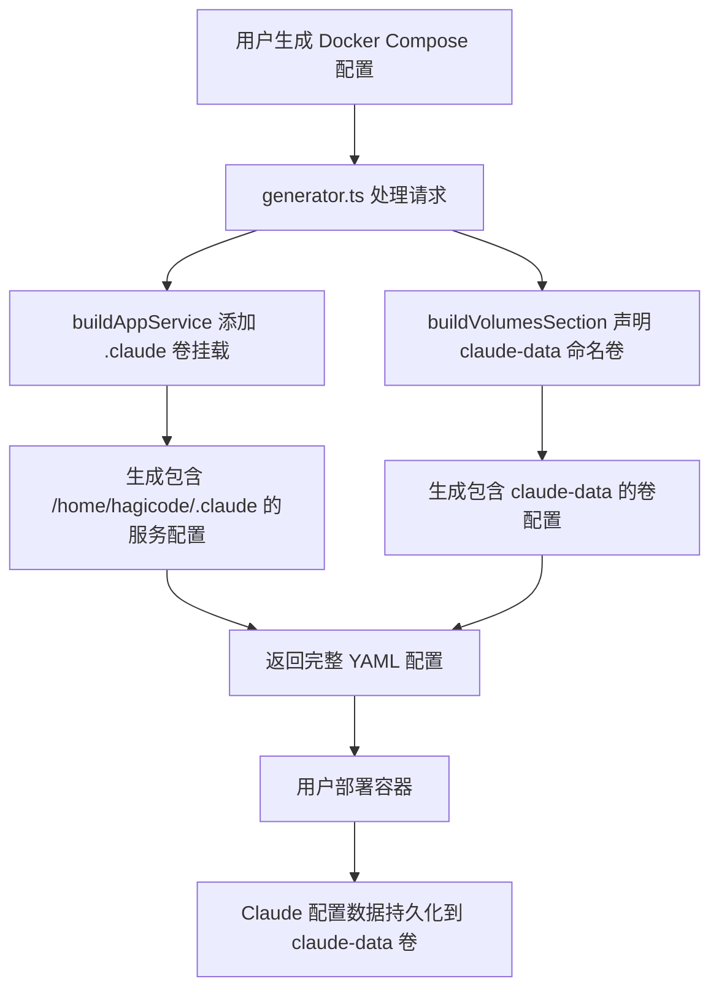
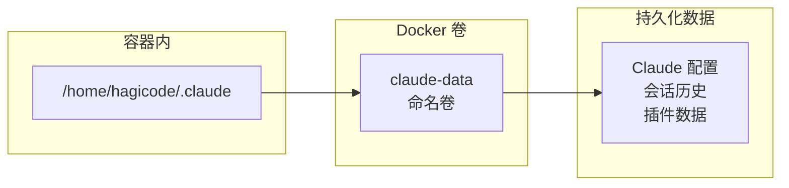

# Change: 持久化 Claude 配置数据命名卷

## Why

当前生成的 Docker Compose 配置中，Claude Code 使用的 `/home/hagicode/.claude` 目录未被声明为命名卷，导致容器重建或重启时用户配置、会话历史和插件数据丢失。这严重影响用户体验，每次重启容器都需要重新配置 Claude 环境。

## What Changes

- 在 `buildAppService` 函数中为 hagicode 服务添加 `/home/hagicode/.claude` 卷挂载
- 在 `buildVolumesSection` 函数中声明新的命名卷 `claude-data`
- 更新相关规格说明以反映新的卷配置
- 确保所有部署模式（快速体验和完整自定义）都包含此持久化配置

## UI Design Changes

不涉及 UI 变更。这是一个后端配置生成器的增强，用户界面无需修改。

## Code Flow Changes

### 数据流图

### 配置变更表格

| 组件 | 变更类型 | 变更说明 | 影响范围 |
|------|---------|---------|---------|
| `buildAppService` | 修改 | 添加 `/home/hagicode/.claude` 卷挂载到 hagicode 服务 | hagicode 服务配置 |
| `buildVolumesSection` | 修改 | 添加 `claude-data` 命名卷声明 | volumes 部分 |
| `DockerComposeConfig` | 无变更 | 不需要新的配置字段 | 数据模型保持不变 |

### 卷挂载配置

## Impact

- **影响的规格**: `docker-compose-generator` (新增 Claude 配置持久化需求)
- **影响的代码**:
  - `src/lib/docker-compose/generator.ts:56-161` (buildAppService 函数)
  - `src/lib/docker-compose/generator.ts:239-255` (buildVolumesSection 函数)
- **向后兼容性**: 新增命名卷不影响现有部署，现有部署会在首次启动时自动创建新卷
- **数据迁移**: 无需数据迁移，新卷会在容器启动时自动初始化
